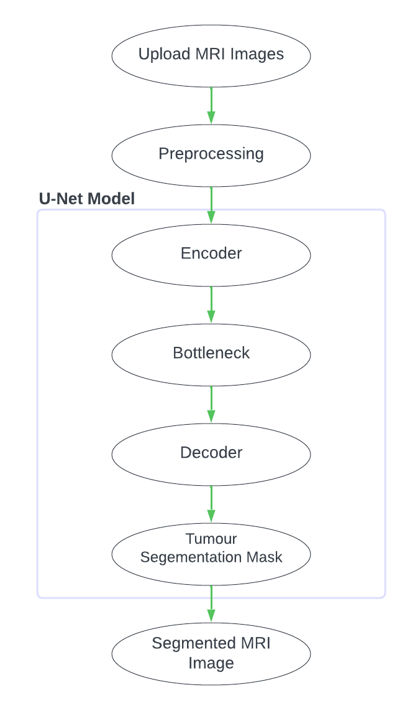

# Brain Tumor Segmentation using U-Net

This project implements a U-Net-based deep learning model to segment brain tumors from MRI images with high precision. By accurately identifying tumor regions, this model aims to assist healthcare professionals in diagnosis, treatment planning, and patient monitoring. The project is developed in Python using TensorFlow and Keras, focusing on high segmentation accuracy and efficient model performance.

### Project Overview
The U-Net model architecture is widely used for biomedical image segmentation tasks because of its symmetrical encoder-decoder structure, which efficiently captures essential spatial information. Our implementation of U-Net includes skip connections, ensuring that crucial features are retained throughout the model. Using the BRATS 2020 dataset, the project leverages these strengths to develop a robust brain tumor segmentation model capable of identifying complex tumor regions in MRI images.

### Architecture and Workflow
The U-Net architecture comprises two main paths: a contracting path (encoder) that reduces spatial dimensions to capture essential features and an expansive path (decoder) that reconstructs the segmentation map. This design, combined with skip connections between corresponding layers in the encoder and decoder, allows the model to retain both fine and coarse details of the image, improving segmentation accuracy.

  
  

The project workflow includes data preprocessing (scaling and normalization of MRI images), training the U-Net model, and generating segmentation outputs. Each phase is designed to ensure seamless processing of MRI data, with the final output showing clear boundaries of the tumor regions for clinical use.

## Results
The trained U-Net model achieved high performance across various metrics, notably a Dice Coefficient of 0.9856, indicating strong overlap between the predicted and true tumor segmentation. This level of accuracy highlights the model's potential as a valuable tool in clinical workflows for assisting radiologists and oncologists in diagnosing and assessing brain tumors.

---

